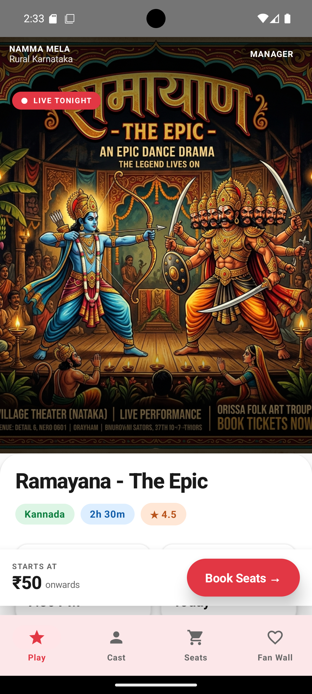
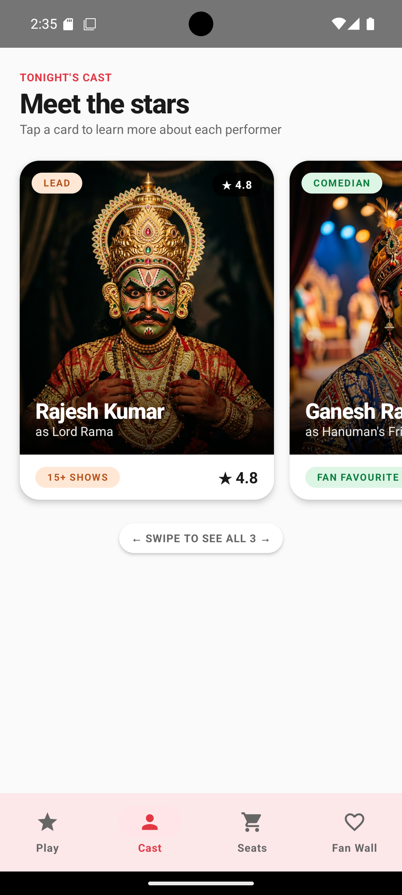
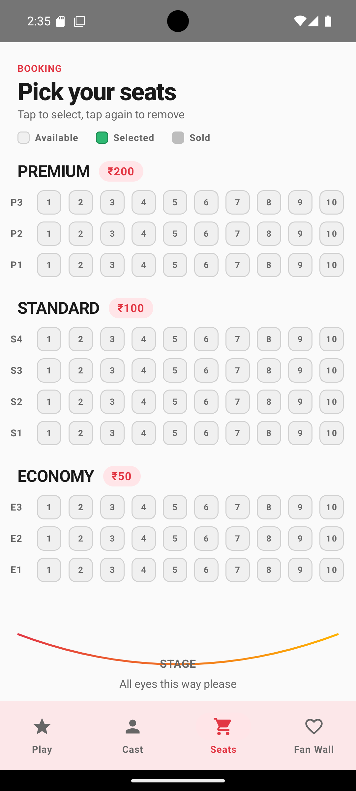

# Namma Mela

**Digital Box Office for Rural Theater**

Namma Mela (Kannada: "Our Festival") is a native Android application that serves as a digital box office for rural village drama troupes in India. It allows theater managers to publish show details and enables audiences to browse plays, view the cast, book seats, and share feedback from their smartphones.

Built with **Kotlin, Jetpack Compose, Room Database, and MVVM architecture**.

Developed as part of the **MindMatrix VTU Internship Program (Project 13)**.

---

## Screenshots

| Play | Cast | Seat Map |
|------|------|----------|
|  |  |  |

---

## Features

- **Tonight's Play** - View the current play poster, title, language, duration, rating, show time, and description. Includes a "Book Seats" call-to-action with pricing starting info.
- **Cast List** - Swipeable horizontal cards showing each performer (Lead Actor, Comedian, Singer) with photos, role names, show count, and ratings.
- **Seat Map** - Interactive grid-based seat selection across three tiers: Premium (Rs.200), Standard (Rs.100), and Economy (Rs.50). Seats are color-coded as Available, Selected, or Sold. Stage indicator at the bottom.
- **Fan Wall** - Community comment feed where audience members post feedback after shows. Users set their display name once, and all future comments use it.
- **Manager Mode** - PIN-protected screen for theater managers to edit play details (name, duration, show time, language, description), update cast names, configure Razorpay test keys, and manage seat resets.
- **Razorpay Payment (Test Mode)** - Simulated payment integration using Razorpay's test SDK. Seats are reserved in Room DB on successful payment.
- **Persistent Storage** - All data (show info, cast, seat bookings, comments, settings) is stored locally using Room Database and survives app restarts.

---

## Tech Stack

| Component | Technology |
|-----------|------------|
| Language | Kotlin |
| UI Framework | Jetpack Compose + Material 3 |
| Architecture | MVVM (ViewModel + Repository) |
| Local Database | Room (SQLite) |
| Image Loading | Coil |
| Payment | Razorpay Test Mode SDK |
| AI (optional) | Google Gemini SDK (dependency included) |
| Settings Storage | Jetpack DataStore Preferences |
| Navigation | Jetpack Navigation Compose |
| Min SDK | API 24 (Android 7.0) |

---

## Project Structure

```
app/src/main/java/com/paraminnovation/nammamela/
    NammaMelaApp.kt              Application class (DB + repos init)
    MainActivity.kt              NavHost + bottom nav + Razorpay listener

    data/
        AppDatabase.kt           Room database definition
        entity/                  Show, Cast, Seat, Comment, Ticket entities
        dao/                     ShowDao, CastDao, SeatDao, CommentDao, TicketDao
        repository/              ShowRepository, SeatRepository,
                                 CommentRepository, SettingsRepository,
                                 TicketRepository

    ui/
        theme/                   Color, Type, Shape, Spacing, Theme
        components/              DashedDivider, Skeleton, TintedIconButton
        viewmodel/               AppViewModel
        screens/                 PlayScreen, CastScreen, SeatMapScreen,
                                 FanWallScreen, ManagerScreen, TicketScreen

    payment/
        RazorpayHandler.kt       Razorpay checkout wrapper
```

---

## Getting Started

### Prerequisites

- Android Studio Iguana (2023.2.1) or newer.
- JDK 17.
- An Android device or emulator running API 24 or higher.

### Open and Build

1. Clone the repository.

```bash
git clone https://github.com/OneAbove411/namma-mela.git
cd namma-mela
```

2. Open this folder in Android Studio using **File > Open**.

3. Wait for Gradle Sync to finish. It will download Gradle 8.7 and all dependencies.

4. If prompted to generate a Gradle wrapper, accept, or run the following command once from a terminal inside this directory:

```bash
gradle wrapper --gradle-version 8.7
```

5. Click the green Run button to build and deploy to an emulator (API 24+) or a connected device. The first launch seeds the database with 100 seats, a default show, default cast, and sample comments.

### Generate an APK

1. In Android Studio, go to **Build > Build App Bundle(s) / APK(s) > Build APK(s)**.
2. The unsigned debug APK is generated at:

```
app/build/outputs/apk/debug/app-debug.apk
```

3. Transfer this file to a phone and install it (enable "Install from unknown sources" if needed).

For a signed release APK, use **Build > Generate Signed Bundle / APK** and follow the keystore creation wizard.

---

## First-Run Defaults

| Setting | Default Value |
|---------|--------------|
| Manager PIN | `1234` (change it inside Manager Mode after first unlock) |
| Show title | Ramayana - The Epic |
| Total seats | 100 (30 Premium, 40 Standard, 30 Economy) |
| Razorpay key | Not set (paste your `rzp_test_...` key in Manager Mode) |

---

## Setting Up Razorpay (Test Mode)

1. Sign up at [razorpay.com](https://razorpay.com).
2. Go to Dashboard > Settings > API Keys > Generate Test Key.
3. Copy the Key ID (starts with `rzp_test_`).
4. In the app, open Manager Mode > paste the key > Save.
5. On the Seats tab, select seats and tap **Pay and Book**.
6. Use the test card `4111 1111 1111 1111`, any future expiry, any CVV, any name.
7. On payment success, seats are marked as reserved in Room.

If the key is not set, the booking button shows a toast asking you to configure it.

---

## Manager Mode

1. Tap the "Manager" button at the top-right of the Play screen.
2. Enter the PIN (default: `1234`).
3. Edit play details: name, duration, show time, language, and description.
4. Edit cast names: lead actor, comedian, and singer.
5. Configure the Razorpay test key.
6. Tap **Save** to apply changes. All updates persist via Room.
7. Use **Reset All Seats** to clear all bookings for a new show.

---

## Access Control

| Role | Access |
|------|--------|
| Audience | Default. Can browse Play, Cast, Seats, and Fan Wall. Can book seats and post comments (after setting a display name once). |
| Manager | Must enter a PIN to access the Manager screen. PIN is SHA-256 hashed and stored in DataStore. Default is `1234` until changed. |

This is local-only access control with no authentication server. It is designed for single-device deployment as scoped by the internship requirements.

---

## Known Limitations

- **Single-device only.** Two phones do not see each other's bookings or comments. Multi-device sync would require a backend (Firebase or Supabase).
- **Cast photos are static drawables.** Manager can change names but not photos.
- **GenAI poster generation** is included as a dependency but no screen is built for it yet. The Kotlin Gemini SDK is ready to use.
- **Launcher icons** are placeholder 192x192 copies across all density buckets. Use Android Studio's Image Asset Studio to generate proper variants before production release.
- **No unit tests.** This is an internship deliverable trade-off.

---

## License

This project is built for educational purposes as part of the MindMatrix VTU Internship Program.
